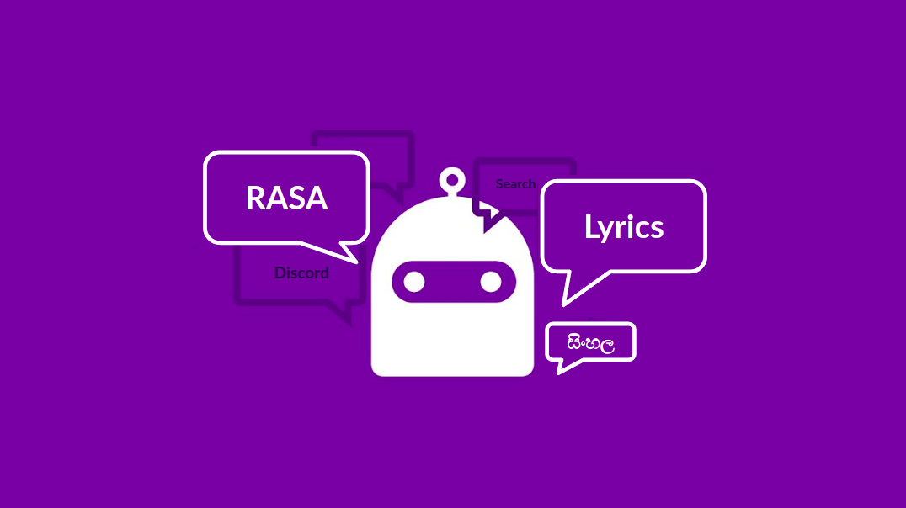
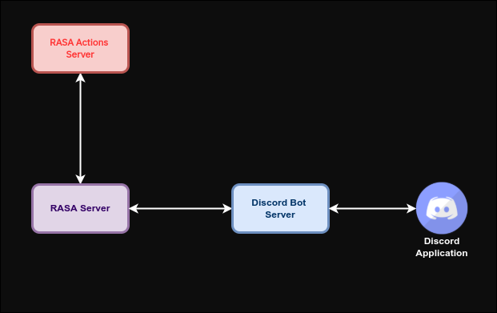

[](https://github.com/rumeshmadhusanka/rasa-chatbot/actions/workflows/main.yml)
[](https://github.com/rumeshmadhusanka/rasa-chatbot/actions/workflows/codeql-analysis.yml)
# RASA Chatbot for Sinhala Song Lyrics
<p align="center">
  
</p>


## Data
This chatbot is trained on Sinhala lyrics scraped from [lyricslk.com](https://lyricslk.com). First the URLs that contain song lyrics are gahtherd. Then the webpages are scraped using BeautifulSoup library. Finally data is cleaned. Sripts relatedd to web scraping and data cleanning are stored in [webscrape](webscrape) directory.<br>
Final data contains the following attributes: 
1. id
2. title 
3. body - lyrics of the song
4. singers (one or more)
5. streams (derived)
6. sentiment (derived)

## Intentions the Chatbot Trained on


| | Intent | Example user utterance|Response from the bot |
| ---| --- | ----------- |-----|
|1|Greet|ආයුඛෝවන්| Greet back|
|2|Goodbye|බායි| Greet goodbye|
|3|Mood great|මම හොඳින් ඉන්නවා|Suggest a song with positive sentiment|
|4|Mood unhappy|මට දුකයි|Suggest a song with negative sentiment|
|5|Bot challenge|ඔබ මනුෂ්‍යයෙක්ද?|Tell that it's a bot|
|6|Find the most popular song|ඔයා ළඟ තියෙන ජනප්‍රියම ගීතය කුමක්ද?|Find the lyrics of the most popular song|
|7|Find the most popular song of an artist|අතුල අධිකාරී ගෙ ජනප්‍රියම ගීතය මොකක්ද?|Find the lyrics of the most popular song of that artist|
|8|List songs of an artist|රූකාන්ත ගුණතිලක කියපු සින්දු මොනවාද?| List the songs of that artist|
|9|Find lyrics of a song|අවසර නැත මට සින්දුවේ ලිරික්ස් හොයල දෙන්න| Match the song to the guess using proximity query. Display the lyrics | 

6,7,8,9 triggers the Actions server

## Training Pipeline
1. WhitespaceTokenizer
2. RegexFeaturizer
3. LexicalSyntacticFeaturizer
4. CountVectorsFeaturizer
5. DIETClassifier
6. ResponseSelector

Pretrained laguage models didn't significantly improve the model. Therefore, pretrained models were not used.<br>

## Lyrics Search
Uses an in memory positional index to find lyrics of a song when the user gives a query containing some part of a song. Uses proximity query to retrieve the matching song. To account for misspellings, Jaccard distance between each word of the query and songs’ words is taken.<br>
Given: query<br>
1. Index the lyrics using positional index. <br>
   Format: \<term>:\[(\<id>,\<pos>),(\<id1>,\<pos1>),]
2. Calculate Jaccard Distance between the each term and each word in the phrase query.<br> 
  J (A,B) = \| A ∩ B | / |A ∪ B|   
  J	=	Jaccard distance<br>
  A	=	set 1<br>
  B	=	set 2<br>
3. Filter the pairs that has a distance less that a pre defined value (0.3 in this case)
4. Run the phrase query with a pre defined distance (4 in this case)
## Discord integration
This is integrated with Discord.

## Deploymnet Guide
<p align="center">
  
</p>


### Install the dependecies
Deployemnt guide for Ubuntu 20.04 on a local machine or a cloud VM <br>
Clone the repository
```
git clone https://github.com/rumeshmadhusanka/rasa-chatbot.git
```
Create a python virtual environment
``` 
virtualenv env
```
Activate the created virtual environment
```
source env/bin/activate
```
Install the dependencies
```
pip3 install -r requirements.txt -r requirements-discord.txt
```
### Scrape Data (optional)
Data is already commited to the repo. If you wish to scrape data yourself you can follow the steps:<br>
Scrape URLs
```
python3 webscrape/scrape.py
```
Scrape the song infomation from the urls
```
python3 webscrape/song-info-scrape.py
```
Clean the data
```
python3 webscrape/divide-singers.py
```
Index the data
```
python3 webscrape/count-words.py
```
### Train the RASA chat bot
```
rasa train 
```
### Integrate with Discord
Create a discord application and obtain a token -- Follow this tutorial: [How to Get a Discord Bot Token](https://www.writebots.com/discord-bot-token/)<br>
Keep this token safe. Don't commit it to GitHub.<br>
Create a `.env` file and store your token
```
echo 'DISCORD_TOKEN=<your-discord-token>' > discord-bot/.env
```
If you don't want to integrate with Discord, replace you can skip the above step. Replace the `rasa run` commnad in the next step with `rasa shell` to interact with the chat bot in your terminal.
## Start the chatbot
Run the foloowing commands on seperate terminals:<br>
To start the chatbot
```
rasa run
```
To run the actions server
```
rasa run actions
```
To start the discord bot
```
python3 discord-bot/bot.py
```
### Run on docker (optional)
```
docker-compose up
```

