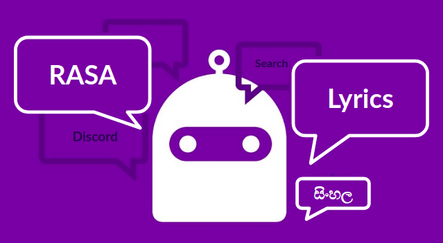

# RASA Chatbot for Sinhala Song Lyrics

  

Deployment guide: [DEPLOYMENT.md](DEPLOYMENT.md) 
## Data
This chatbot is trained on Sinhala lyrics scraped from [lyricslk.com](https://lyricslk.com). First the URLs that contain song lyrics are gahtherd. Then the webpages are scraped using BeautifulSoup library. Finally data is cleaned. Sripts relatedd to web scraping and data cleanning are stored in [webscrape](webscrape) directory. 
Final data contains the following attributes: 
1. id
2. title 
3. body - lyrics of the song
4. singers (one or more)
5. streams (derived)
6. sentiment (derived)

## Intentions the Chatbot Trained on

| | Intent | Example user utterance|
| ---| --- | ----------- |
|1|Greet|ආයුඛෝවන්|
|2|Goodbye|බායි|
|3|Mood great|මම හොඳින් ඉන්නවා|
|4|Mood unhappy|මට දුකයි|
|5|Bot challenge|ඔබ මනුෂ්‍යයෙක්ද?|
|6|Find the most popular song|ඔයා ළඟ තියෙන ජනප්‍රියම ගීතය කුමක්ද?|
|7|Find the most popular song of an artist|අතුල අධිකාරී ගෙ ජනප්‍රියම ගීතය මොකක්ද?|
|8|List songs of an artist|රූකාන්ත ගුණතිලක කියපු සින්දු මොනවාද?|
|9|Find lyrics of a song|අවසර නැත මට සින්දුවේ ලිරික්ස් හොයල දෙන්න|

## Training Pipeline
1. WhitespaceTokenizer
2. RegexFeaturizer
3. LexicalSyntacticFeaturizer
4. CountVectorsFeaturizer
5. DIETClassifier
6. ResponseSelector

Pretrained laguage models didn't significantly improve the model. Therefore, pretrained models were not used. 

## Lyrics Search
Uses an in memory positional index to find lyrics of a song when the user gives a query containing some part of a song. Uses proximity query to retrieve the matching song. To account for misspellings, Jaccard similarity between each word of the query and songs’ words is taken.

## Discord integration
This is integrated with Discord.

## Deploymnet 

  

Deployment guide: [DEPLOYMENT.md](DEPLOYMENT.md) 
